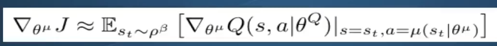
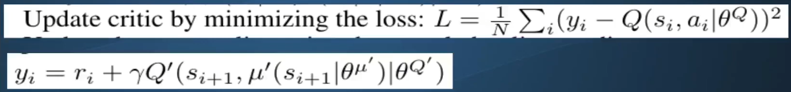
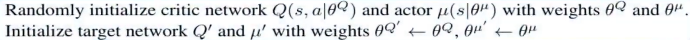
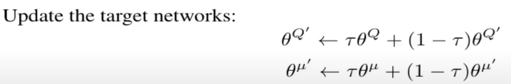

# DDPG Notes

## Fundamental concepts & implementation notes (Phil)

- PG: policy gradient, for applying RL to continous actions paces.
- DQL: can't handle such spaces, needs discretization. 
    - Discrete outputs only, from DQL.
    - To discretize: for many DOF, the number of discrete actions goes towards thousands quickly. DQL will degenerate.

Takes the innovations from DQL to PG => DDPG.
1. **Replay memory**: learns from replay memory, instead of just previous experience to update NN - less variance.
2. **Target networks**, double DQN?
    - Instead of same network for both values and action chosen - causes a lot of variance and instability. "chacing own tail".
    - Online network: choses action at each timestep (policy), Target network: evaluate value of action (value function).
    - Values used to update weights of ANN. 
    - "Hard update" of target network: values from online network copied over to target network, every N steps of training.
        - ***Same as double deep Q learning?*** 

**DDPG** uses "soft copy" of target network - uses hyperparameter **tau** when copying (0.001).

Will use more than 1 target network as well: DDPG is an **AC method**:
- One network for actor, and one for critic normally.
- DDPG uses 4 network: actor, critic, target actor, target citic.

**AC** Bacis idea:
- Critic network evaluates s,a pair (Q-value); so given s, and a chosen evaluates what value such action is worth in that state.
- Actor: choses the action to be critiqued. 
    - Outputs action values, **not** probabilities: so a continous value.
    - Policy is a probability distribution, of picking an action given action space.
    - Deterministic? DDPG output action value itself - gives only a single action, same every time.
- Problem: explore / exploit dilemma: needs some exploration.
    - Adds noice to do exploration: add noice to actor output.
    - Here: uses gaussian, however DDPG guys (lillicrap) used OA-noice; physical gaussian noice.

**Update rule for actor**

- Somewhat complex. Gradient of cost function (J), with respect to parameters of network (theta^mu), where mu is the actor network. 
- Expected to gradient of the critic netork (^Q), which is the one predicting the Q value.
- Also seen: action chosen according to current policy (mu). 
- So:
    - Randomly sample states from memory / replay buffer.
    - Use actor to determine actions for those seens states.
    - Plug those into critic to get value: what it thinks the Q value of s, a is. => Loss.
    - Take the gradient of the critic network, using gradient tape,  w.r.t the actor network parameters.  

**Critic network** implementation: very close to DQL:

(Basically quadratic loss)
- Randomly sample states, new state, actions, rewards from replay buffer.
- Use **target actor** network to determine actions for new states.
- Plug those actions into **target critic** to get target y; adding reward from memory and multiplying with gamma. 
    - This is target we want to shift the estimates of the critic towards!
- Plug states, actions into critic and take diff with target: update! MSE loss function of tf2.

**Target network updates**

(At beginning of program)

- So we start by exact hard copy, for all other times we use the soft update rule.

- Tau is used to dampen the updates, so mostly keeping the old weights of target networks. Hence "soft update".
- Slowly changing function.

**Data structures needed**
- Replay buffer: uses numpy arrays. Easy to enumerate and understand. However not optimal.
- TF2 : one each for actor and critic network. Forward pass, initializer.
- Agent class to tie it all together. Memory buffer, all four networks, choose action based on current training, learning from sampled memory, checkpointing models.
- Main loop to train and evaluate.

